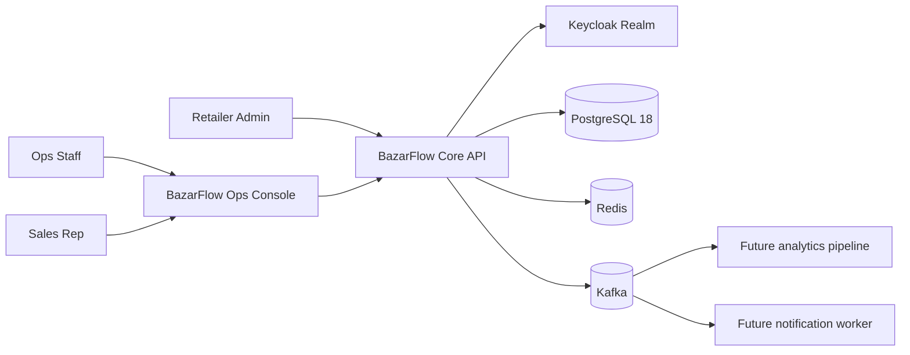
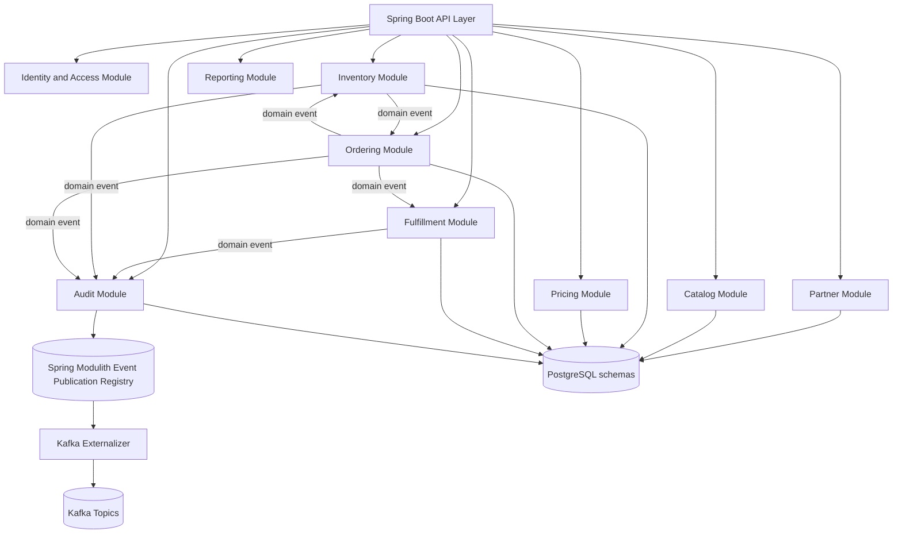
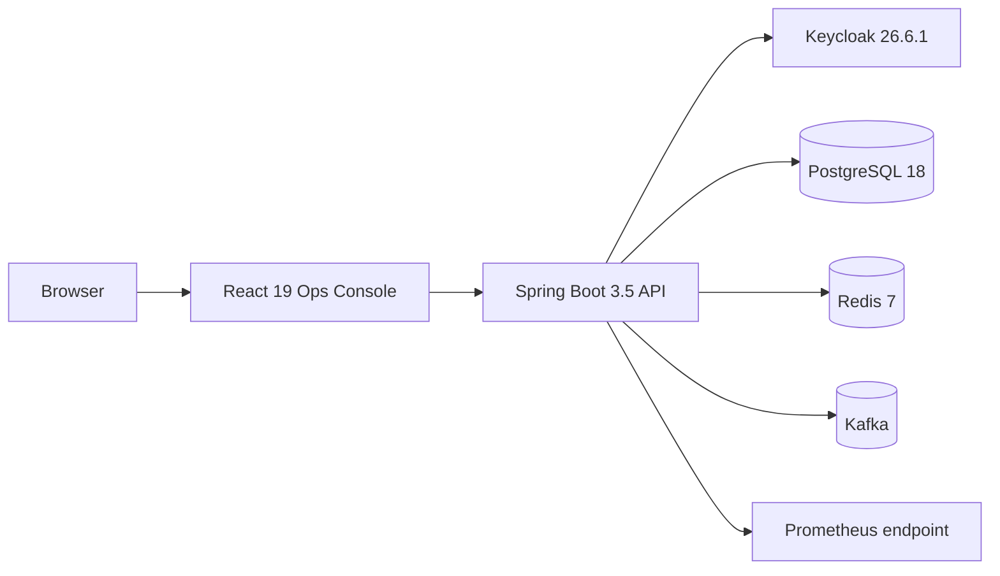
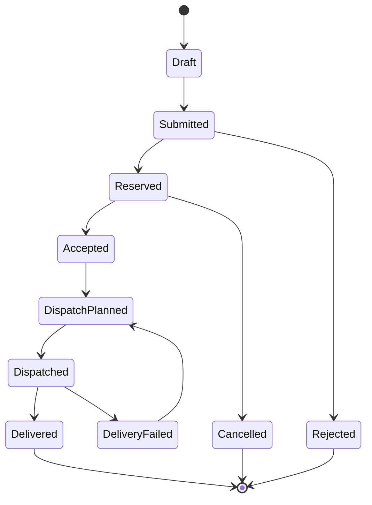
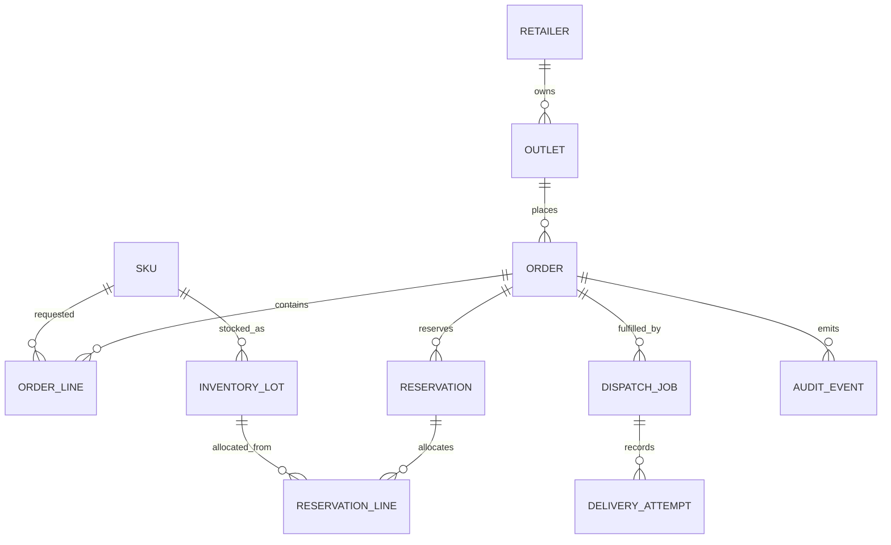
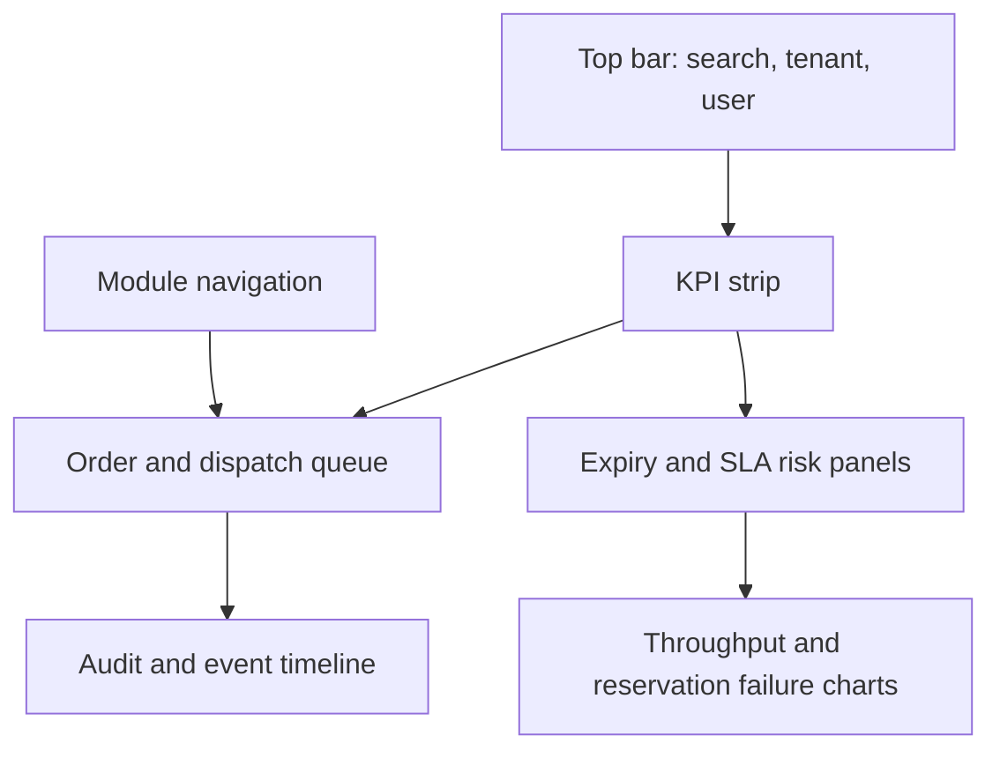

# BazarFlow Core Full Implementation Plan

Research date: April 30, 2026

Target repository: `RamlyBurger/bazarflow-core`

Remote repository policy: the GitHub repository was created empty first. Once Phase 0 implementation starts, push verified commits normally so work is backed up.

## Decision Summary

`bazarflow-core` should be built as a production-style modular monolith, not as many separate microservices in the first version.

The first implementation target is:

`Java 17+ baseline, Java 21 LTS verified + Spring Boot 3.5.14 + PostgreSQL 18.3 + Keycloak 26.6.1 + React 19.2 + Vite 8.0.x ops console`

Reasoning:

- Spring Boot 4.0.x is current stable, but it is a major migration line. Spring's own release notes recommend upgrading to Spring Boot 3.5 before migrating to 4.0. For a first implementation that should run cleanly with Springdoc, Testcontainers, Keycloak, and common enterprise integrations, Spring Boot 3.5.14 is the stronger first implementation target.
- Spring Boot 3.5 supports Java 17 or later. The code should keep a Java 17+ baseline and be tested on Java 21 LTS.
- Spring Modulith 2.x is now the current stable generation, but it moved to a Spring Boot 4 / Spring Framework 7 baseline. For the Spring Boot 3.5 path, use Spring Modulith 1.4.11 internally for module verification and event publication, then plan a later Boot 4 + Modulith 2.x upgrade branch.
- A modular monolith gives clear module boundaries, event-driven design, integration tests, and realistic domain complexity without requiring the operational overhead of six services from day one.
- Kafka will still be included, but as event externalization after the core module events work locally.

## Repository And Git Backup Workflow

All future implementation work should be backed up with Git in small, understandable steps.

- Work from the `RamlyBurger/bazarflow-core` remote using the `RamlyBurger` maintainer identity unless a contributor workflow is explicitly requested.
- Check `git status --short --branch` before changing files.
- Use short-lived feature branches for meaningful implementation work, for example `feat/order-workflow` or `docs/bootstrap-readme`.
- Commit each completed logical change with a clear message after verification.
- Push completed branches or approved mainline work to GitHub so changes are backed up remotely.
- Do not leave completed implementation work only in the working tree.
- Do not rewrite or discard user changes unless explicitly requested.

## Product Concept

`BazarFlow Core` is a B2B ordering and fulfillment platform for chilled and frozen food distributors supplying small retailers, cafes, and convenience stores.

The system handles:

- retailer onboarding
- SKU catalog and batch traceability
- inventory receiving and stock reservation
- order intake
- tiered pricing
- delivery SLA planning
- dispatch workflow
- tamper-evident audit trail
- operational dashboard

This is not a generic ecommerce clone. The unique angle is distributor operations: expiry-aware stock allocation, delivery SLA risk, batch traceability, and operational auditability.

## Current Implementation State

The initial repository scaffold is in place. The backend now has module-boundary verification, PostgreSQL migrations, Spring Security method guards, problem-details error handling, request correlation IDs, partner APIs, catalog product/SKU APIs, inventory lot receiving with stock movement recording, pricing quote APIs, priced order draft/submission APIs, and expiry-aware stock reservation across inventory lots. These backend slices are covered by PostgreSQL-backed Testcontainers integration tests.

The next implementation slice should add audit event capture for order and inventory state changes, then expose an order timeline that combines status changes with operational events.

## Engineering Scope

| Area | Implementation notes |
|---|---|
| `Java` | Java 17+ backend baseline with Java 21 LTS CI verification |
| `Spring Boot` | Spring Boot API, security, actuator, validation, data access |
| `Architecture` | Spring Boot modular monolith with service-extraction boundaries |
| `Spring Security` | OAuth2 Resource Server with Keycloak-issued JWTs |
| `REST API` | OpenAPI 3.1, Swagger UI, HTTP examples |
| `PostgreSQL` | normalized schema, selective JSONB metadata, indexes, constraints |
| `Kafka` | event externalization, retry, dead-letter topics |
| `Docker` | full local stack using Docker Compose |
| `Testcontainers` | integration tests against real PostgreSQL, Redis, Kafka |
| `CI/CD` | GitHub Actions primary pipeline, optional Jenkinsfile later |
| `Observability` | actuator, Micrometer, Prometheus endpoint, trace IDs |
| `Security` | RBAC, idempotency, audit hash chain, rate limiting plan |

## Research Notes

### Official technology findings

- Spring Boot 4.0.6 is listed as current stable in the Spring docs and requires Java 17 or later, compatible up to Java 26.
- Spring Boot 3.5.14 was released on April 23, 2026 with bug fixes, documentation improvements, dependency upgrades, and CVE fixes.
- Spring Boot 3.5 requires Java 17 or later and is compatible up to Java 25.
- Java positioning for this repository should be Java 17+ baseline, verified on Java 21 LTS.
- Spring Boot's dependency management should be trusted; avoid overriding managed dependency versions unless necessary.
- Spring Modulith 2.0.6 is the current stable generation, but Spring Modulith 2.0 GA upgraded its baseline to Spring Boot 4 and Spring Framework 7.
- Spring Modulith 1.4.11 remains the right line for the Spring Boot 3.5.14 implementation path. Import `org.springframework.modulith:spring-modulith-bom:1.4.11`.
- Spring Modulith supports logical module verification, application module tests, event publication, event externalization, and documentation generation.
- Spring Security 6.5 supports OAuth2 Resource Server JWT configuration using `oauth2ResourceServer(jwt(Customizer.withDefaults()))`; deprecated chained styles should be avoided.
- Testcontainers Java 2.0.x supports JUnit 5 containers for real dependency integration tests.
- Flyway validates migration names, types, and checksums against applied migrations; migration files must be treated as immutable after merge.
- PostgreSQL 18.3 is the current 18.x minor release, and PostgreSQL 18 supports JSONB GIN indexing with `jsonb_ops` and `jsonb_path_ops`, with different tradeoffs for key-existence versus containment queries.
- PostgreSQL is the primary implementation database. Core relational modeling should stay portable where practical so the model can be adapted to MySQL or Oracle if needed. PostgreSQL-specific features such as JSONB should be isolated and documented.
- Keycloak downloads page lists 26.6.1 as the current server download on April 30, 2026. Keycloak JavaScript adapters and Java client libraries have separate versioning, so do not assume client artifacts share the server version.
- React 19.2 is available and includes `Activity`, `useEffectEvent`, and updated React Hooks lint behavior.
- Vite's supported versions on April 30, 2026 are `vite@8.0`, `vite@7.3`, and `vite@6.4`; the docs show `v8.0.10` as current, so pin to the 8.0 minor unless ecosystem friction appears.

### Repository examples studied

- `xsreality/spring-modulith-with-ddd`
  - Useful for DDD + Spring Modulith + Keycloak + Swagger presentation.
  - The README gives concrete business rules and API examples, which is worth copying as a documentation pattern.
- `sivaprasadreddy/spring-modular-monolith`
  - Useful for practical module boundaries, schema isolation, event-driven module communication, compose setup, `Taskfile.yml`, and HTTP request examples.
- `hacisimsek/ecommerce-microservices`
  - Useful for saga pattern language, service responsibilities, Kafka event diagrams, and README structure.
  - Do not copy its service split in phase 1 because it adds too much operational scope.
- `sogutemir/SpringMicroservice-outbox-kafka-saga-pattern`
  - Useful for hexagonal architecture, DDD vocabulary, and reliable messaging with outbox pattern.
- `awesome-readme-examples`
  - Useful for presentation expectations: badges, architecture image, quickstart, screenshots, and readable sections.

## Revision From The Earlier Architecture Plan

The original high-level plan described `bazarflow-core` as event-driven B2B fulfillment. That remains correct.

The revised implementation structure is:

- start with one deployable Spring Boot application
- enforce modules using Spring Modulith
- use one PostgreSQL database with separate schemas per bounded context
- publish domain events internally first
- externalize selected events to Kafka after the business workflow works
- include a small React ops console for visual demonstration

This keeps the project deep, finishable, and operationally coherent.

## System Architecture

### Context Diagram



### Application Component Diagram



### Runtime Stack



## Architecture Style

Use:

- Domain-Driven Design
- modular monolith
- hexagonal architecture inside high-complexity modules
- CQRS-light for dashboard reads
- event-driven module communication
- transactional domain events
- optimistic concurrency control
- idempotent command handling
- append-only audit log

Avoid in phase 1:

- full microservice split
- distributed transactions across services
- API gateway
- service discovery
- multiple independent databases
- Kubernetes in this repo

Those are better handled by `bazarflow-platform`.

## Repository Structure

Recommended structure:

```text
bazarflow-core/
  README.md
  LICENSE
  SECURITY.md
  CONTRIBUTING.md
  Taskfile.yml
  compose.yml
  .env.example
  .github/
    workflows/
      ci.yml
      docker.yml
  docs/
    architecture.md
    api.md
    demo-script.md
    adr/
      0001-use-modular-monolith.md
      0002-use-spring-boot-3-5-first.md
      0003-use-postgres-schema-per-module.md
      0004-use-spring-modulith-events.md
    diagrams/
      architecture.mmd
      order-flow.mmd
      inventory-state.mmd
  http/
    auth.http
    catalog.http
    inventory.http
    orders.http
    fulfillment.http
  server/
    pom.xml
    src/
      main/
        java/io/ramlyburger/bazarflow/
          BazarFlowApplication.java
          common/
          identity/
          partner/
          catalog/
          inventory/
          pricing/
          ordering/
          fulfillment/
          audit/
          reporting/
        resources/
          application.yml
          application-local.yml
          db/migration/
      test/
        java/io/ramlyburger/bazarflow/
  ops-console/
    package.json
    vite.config.ts
    src/
      app/
      features/
        dashboard/
        orders/
        inventory/
        fulfillment/
        audit/
      shared/
```

## Backend Module Design

### `common`

Purpose:

- shared value objects
- exception model
- problem details response
- pagination types
- money and quantity utilities
- trace ID propagation

Important types:

- `Money`
- `Quantity`
- `TenantId`
- `CorrelationId`
- `IdempotencyKey`
- `BusinessException`
- `ProblemDetailFactory`

### `identity`

Purpose:

- local authorization helper layer
- maps JWT claims to application roles
- exposes current actor metadata to domain/application services

External dependency:

- Keycloak handles authentication, user storage, and token issuance.

Roles:

- `ROLE_OPS_MANAGER`
- `ROLE_WAREHOUSE`
- `ROLE_SALES`
- `ROLE_DISPATCH`
- `ROLE_AUDITOR`

### `partner`

Purpose:

- manage retailers, outlets, delivery zones, and credit status

Entities:

- `Retailer`
- `Outlet`
- `DeliveryZone`
- `CreditProfile`

Useful business rules:

- blocked retailers cannot submit new orders
- outlets have delivery windows
- order minimum can vary by zone

### `catalog`

Purpose:

- manage SKUs, categories, storage requirements, and product metadata

Entities:

- `Product`
- `Sku`
- `ProductCategory`
- `StorageClass`

Important terms:

- SKU
- cold chain
- halal traceability metadata
- unit of measure

### `inventory`

Purpose:

- receive stock by lot/batch
- allocate stock using expiry-aware rules
- reserve and release inventory
- detect low-stock and expiry-risk conditions

Entities:

- `InventoryLot`
- `StockMovement`
- `Reservation`
- `ReservationLine`
- `StockAdjustment`

Core statuses:

- `AVAILABLE`
- `RESERVED`
- `PICKED`
- `DISPATCHED`
- `EXPIRED`
- `QUARANTINED`

### `pricing`

Purpose:

- apply contract price, tiered quantity discount, campaign discount, and zone surcharge

Entities:

- `PriceBook`
- `PriceRule`
- `PriceQuote`

Core idea:

- keep pricing deterministic and explainable
- return `appliedRules` in the API response

### `ordering`

Purpose:

- order intake
- order validation
- order state machine
- idempotent submission
- coordination with inventory and pricing

Entities:

- `Order`
- `OrderLine`
- `OrderStatusHistory`
- `IdempotencyRecord`

Order states:



### `fulfillment`

Purpose:

- generate pick waves
- plan dispatch jobs
- track delivery SLA risk
- record delivery completion or failure

Entities:

- `PickWave`
- `DispatchJob`
- `DeliveryAttempt`
- `SlaPolicy`

Algorithm:

- earliest due date first
- group by delivery zone
- apply vehicle capacity limit
- flag SLA risk when `now + estimatedRouteDuration > promisedWindowEnd`

### `audit`

Purpose:

- append-only operational audit
- tamper-evident event chain
- event timeline for operational traceability

Entities:

- `AuditEvent`
- `AuditHashCheckpoint`

Algorithm:

- canonicalize event payload JSON
- compute `event_hash = SHA-256(previous_hash + canonical_payload + occurred_at + actor_id)`
- store `previous_hash` and `event_hash`
- provide audit verification endpoint

### `reporting`

Purpose:

- read-optimized dashboard queries
- operational KPIs
- low-stock and SLA risk summaries

Do not overbuild a full warehouse in this repo. The separate `techpulse-my` and future analytics work can go deeper.

## Database Design

Use one PostgreSQL database with schemas per module.

RDBMS portability note:

- PostgreSQL is the primary implementation target.
- Keep the core domain schema normalized and portable where practical.
- Isolate PostgreSQL-specific features such as JSONB and GIN indexes behind clearly named columns, queries, and documentation.
- If the deployment environment requires MySQL or Oracle later, migrate core tables first and revisit only the PostgreSQL-specific reporting and audit search paths.

Schemas:

- `partner`
- `catalog`
- `inventory`
- `pricing`
- `ordering`
- `fulfillment`
- `audit`
- `modulith`

### Core Tables

```text
partner.retailers
partner.outlets
partner.delivery_zones

catalog.products
catalog.skus
catalog.product_categories

inventory.inventory_lots
inventory.stock_movements
inventory.reservations
inventory.reservation_lines

pricing.price_books
pricing.price_rules
pricing.price_quotes

ordering.orders
ordering.order_lines
ordering.order_status_history
ordering.idempotency_records

fulfillment.pick_waves
fulfillment.dispatch_jobs
fulfillment.delivery_attempts

audit.audit_events
audit.audit_hash_checkpoints
```

### Entity Relationship Diagram



### Indexing Plan

Use B-tree indexes for:

- foreign keys
- `order_number`
- `retailer_id`
- `sku_id`
- `status`
- `created_at`
- `expiry_date`

Use partial indexes for:

- active reservations
- undelivered dispatch jobs
- inventory lots where `available_quantity > 0`

Use JSONB only where it adds flexibility:

- `catalog.products.metadata`
- `audit.audit_events.payload`
- `ordering.idempotency_records.response_body`

Use GIN indexes selectively:

- `audit.audit_events(payload jsonb_path_ops)` for containment-style audit searches
- `catalog.products(metadata jsonb_path_ops)` for product metadata filters

Do not store core order or inventory structure as JSONB. Those should be normalized.

## Key Algorithms

### 1. Idempotent Order Submission

Problem:

- A retailer or sales rep may retry an order submission after a timeout.
- Retrying must not create duplicate orders.

Inputs:

- `tenant_id`
- `actor_id`
- `idempotency_key`
- `request_hash`
- request payload

Algorithm:

```text
begin transaction
  existing = find idempotency record by tenant_id + endpoint + idempotency_key

  if existing exists and existing.request_hash == request_hash:
      return stored response with original status code

  if existing exists and existing.request_hash != request_hash:
      return 409 IDEMPOTENCY_KEY_REUSED_WITH_DIFFERENT_PAYLOAD

  insert idempotency record with status PROCESSING
  validate order
  create order
  price order
  attempt inventory reservation
  store response body and status code
commit transaction
```

Database constraints:

- unique index on `(tenant_id, endpoint, idempotency_key)`
- hash column using SHA-256

This demonstrates API reliability and real-world backend thinking.

### 2. FEFO Inventory Allocation

FEFO means first-expiry-first-out.

Problem:

- Frozen/chilled products must be allocated from lots that expire earliest, while respecting available stock and quarantined batches.

Inputs:

- `sku_id`
- `requested_quantity`
- `minimum_shelf_life_days`
- `warehouse_id`

Algorithm:

```text
remaining = requested_quantity
allocations = []

candidate lots =
  available lots for sku and warehouse
  where expiry_date >= today + minimum_shelf_life_days
  where status = AVAILABLE
  order by expiry_date asc, received_at asc
  lock rows for update skip locked

for each lot in candidate lots:
  if remaining == 0:
      break

  allocated = min(lot.available_quantity, remaining)
  allocations.add(lot_id, allocated)
  remaining -= allocated

if remaining > 0:
  release all locks and return insufficient stock

create reservation and reservation_lines
decrement lot.available_quantity
increment lot.reserved_quantity
```

Technical terms to expose in docs:

- pessimistic row lock
- optimistic version column
- concurrency invariant
- partial allocation rejection
- reservation TTL
- stock movement ledger

Invariants:

- `available_quantity >= 0`
- `reserved_quantity >= 0`
- `available_quantity + reserved_quantity + dispatched_quantity <= received_quantity`
- expired or quarantined lots cannot be reserved

### 3. Reservation Expiry Sweep

Problem:

- Orders may reserve stock but never get accepted or dispatched.

Algorithm:

```text
every 5 minutes:
  find reservations where status = ACTIVE and expires_at < now
  for each reservation:
      set status = EXPIRED
      for each reservation line:
          decrement lot.reserved_quantity
          increment lot.available_quantity
          append stock movement RELEASE_EXPIRED_RESERVATION
      publish ReservationExpired event
```

Concurrency:

- use transaction boundaries per reservation
- use `FOR UPDATE` on reservation rows
- handle already-consumed reservation as no-op

### 4. Tiered Pricing Rule Selection

Problem:

- Different retailers may have contract prices, quantity tiers, campaign discounts, or delivery zone surcharges.

Rule model:

- `priority`
- `scope`
- `condition_expression`
- `effect_type`
- `effect_value`
- `valid_from`
- `valid_to`

Keep the first version deterministic:

```text
base price = SKU list price
candidate rules = active rules for retailer, SKU, category, zone
sort by priority desc, specificity desc, created_at asc

for each rule:
  if condition matches:
      apply rule effect
      add rule to appliedRules

return final price + explanation
```

Avoid building a full rules engine in v1. A clear deterministic rule evaluator is more useful and easier to test.

### 5. Dispatch SLA Risk Scoring

Problem:

- Ops staff need to know which deliveries are at risk before they fail.

Heuristic:

```text
risk_score =
  minutes_late_projection * 3
  + priority_weight
  + cold_chain_penalty
  + failed_attempt_penalty
  - route_capacity_fit_bonus
```

Where:

- `minutes_late_projection = max(0, estimated_arrival_time - promised_window_end)`
- `cold_chain_penalty` applies to frozen/chilled goods
- `route_capacity_fit_bonus` reduces risk if the job fits an existing route

This is not a full vehicle-routing solver. It is an operations-oriented heuristic that can be explained in the README.

### 6. Event Publication And Kafka Externalization

Phase 1:

- publish Spring application events between modules
- use Spring Modulith event publication registry
- test events with `@ApplicationModuleTest` and `PublishedEvents`

Phase 2:

- externalize selected events to Kafka
- configure retry and dead-letter topics
- store event correlation IDs

Events to externalize:

- `OrderSubmitted`
- `StockReserved`
- `StockReservationFailed`
- `OrderAccepted`
- `DispatchPlanned`
- `DeliveryCompleted`

Kafka topic naming:

```text
bazarflow.order.v1
bazarflow.inventory.v1
bazarflow.fulfillment.v1
bazarflow.audit.v1
```

Error handling:

- `DefaultErrorHandler`
- `DeadLetterPublishingRecoverer`
- topic suffix `.DLT`
- non-retryable exceptions for validation and deserialization errors

### 7. Tamper-Evident Audit Chain

Problem:

- The audit timeline should show real integrity thinking.

Algorithm:

```text
previous = latest audit event hash for tenant
payload = canonical_json(event_type, aggregate_id, actor_id, occurred_at, diff)
event_hash = sha256(previous + payload)

insert audit event:
  previous_hash = previous
  event_hash = event_hash
```

Verification endpoint:

```text
GET /api/audit/chains/{tenantId}/verify
```

Returns:

- `valid`
- `checkedEvents`
- `firstBrokenEventId`
- `checkedAt`

### 8. Dashboard Read Model

Problem:

- The UI needs fast summary queries without polluting command-side domain services.

Approach:

- use query services in `reporting`
- keep queries read-only
- use SQL projections for dashboard metrics
- avoid premature CQRS infrastructure

Example metrics:

- open orders
- orders at SLA risk
- low-stock SKUs
- expiring lots in 7 days
- reservation failure rate
- dispatch backlog by zone

## API Design

Base path:

```text
/api
```

Documentation:

```text
/swagger-ui.html
/v3/api-docs
```

### Partner API

```text
POST   /api/retailers
GET    /api/retailers
GET    /api/retailers/{retailerId}
POST   /api/retailers/{retailerId}/outlets
PATCH  /api/retailers/{retailerId}/credit-status
```

### Catalog API

```text
POST   /api/products
GET    /api/products
POST   /api/skus
GET    /api/skus
GET    /api/skus/{skuId}
PATCH  /api/skus/{skuId}/status
```

### Inventory API

```text
POST   /api/inventory/lots
GET    /api/inventory/lots
GET    /api/inventory/availability?skuId={skuId}
POST   /api/inventory/adjustments
POST   /api/inventory/reservations/{reservationId}/release
GET    /api/inventory/expiry-risk
```

### Pricing API

```text
POST   /api/pricing/quote
POST   /api/pricing/rules
GET    /api/pricing/rules
```

### Order API

```text
POST   /api/orders
POST   /api/orders/{orderId}/submit
GET    /api/orders
GET    /api/orders/{orderId}
POST   /api/orders/{orderId}/accept
POST   /api/orders/{orderId}/cancel
GET    /api/orders/{orderId}/timeline
```

Headers:

```text
Idempotency-Key: client-generated-key
Authorization: Bearer <jwt>
X-Correlation-Id: optional-correlation-id
```

### Fulfillment API

```text
POST   /api/fulfillment/pick-waves
GET    /api/fulfillment/pick-waves
POST   /api/fulfillment/dispatch-jobs
GET    /api/fulfillment/dispatch-jobs
POST   /api/fulfillment/dispatch-jobs/{jobId}/complete
POST   /api/fulfillment/dispatch-jobs/{jobId}/fail
GET    /api/fulfillment/sla-risk
```

### Audit API

```text
GET    /api/audit/events
GET    /api/audit/aggregates/{aggregateId}/timeline
GET    /api/audit/chains/{tenantId}/verify
```

### Reporting API

```text
GET    /api/reporting/dashboard
GET    /api/reporting/stock-risk
GET    /api/reporting/order-throughput
GET    /api/reporting/dispatch-backlog
```

## Event Catalog

| Event | Producer | Consumer | Purpose |
|---|---|---|---|
| `RetailerCreated` | partner | audit | audit onboarding |
| `ProductCreated` | catalog | audit | audit catalog changes |
| `BatchReceived` | inventory | audit, reporting | stock movement |
| `OrderDrafted` | ordering | audit | order creation |
| `OrderSubmitted` | ordering | inventory, audit | start reservation |
| `StockReserved` | inventory | ordering, fulfillment, audit | continue workflow |
| `StockReservationFailed` | inventory | ordering, audit | reject or backorder |
| `OrderAccepted` | ordering | fulfillment, audit | ready to pick |
| `DispatchPlanned` | fulfillment | audit, reporting | delivery scheduled |
| `DeliveryCompleted` | fulfillment | inventory, audit, reporting | close workflow |
| `ReservationExpired` | inventory | ordering, audit | release stock |

## Security Design

Authentication:

- Keycloak local realm in Docker Compose
- OAuth2 Authorization Code flow for ops console
- JWT bearer token for API requests

Authorization:

- Spring Security method-level checks
- role-based access control
- module services do not trust controller-only checks

Security rules:

- `ROLE_WAREHOUSE` can receive stock and adjust inventory
- `ROLE_SALES` can draft and submit orders
- `ROLE_OPS_MANAGER` can accept, cancel, and override orders
- `ROLE_DISPATCH` can manage fulfillment
- `ROLE_AUDITOR` can read audit endpoints but cannot mutate operations

Controls:

- request validation with Jakarta Bean Validation
- problem-details error responses
- idempotency for mutating order commands
- correlation IDs for traceability
- audit event for every state transition
- rate limiting can be added with Redis token bucket in phase 2

## Frontend Ops Console

The frontend is not a landing page. It should look like a real internal operations tool.

Stack:

- React 19.2
- Vite 8.0.x, pinned to the supported minor
- TypeScript
- TanStack Query 5
- Recharts 3
- Tailwind CSS 4 or CSS modules if setup friction appears
- Lucide icons

Screens:

- Command Center
- Order Intake
- Inventory Lots
- Expiry Risk
- Dispatch Board
- Audit Timeline
- API Event Stream

### Visual Direction

Style:

- dense operational SaaS
- light background
- carbon text
- teal for successful flow
- amber for warning and expiry risk
- red for failures
- blue only for neutral links and selected navigation

Avoid:

- giant landing page hero
- decorative gradient blobs
- generic purple admin theme
- empty cards with promotional copy

### Dashboard Layout



Demo UI data should come from real API endpoints, not hardcoded static arrays after the backend exists.

## Local Development Stack

Docker Compose services:

- `postgres`
- `redis`
- `kafka`
- `keycloak`
- `mailpit` or `mailhog` for future email simulation
- optional `prometheus`

Developer commands through `Taskfile.yml`:

```text
task setup
task up
task down
task test
task api
task ui
task verify
task demo-seed
```

## Maven Dependency Plan

Use Maven wrapper for accessibility and employer familiarity.

Version alignment:

- Spring Boot parent: `3.5.14`
- Spring Modulith BOM: `1.4.11`
- Java baseline: `17+`
- Java verification target: `21 LTS`
- PostgreSQL Docker image: `postgres:18.3`
- Keycloak Docker image: `quay.io/keycloak/keycloak:26.6.1`
- Vite: pin to `8.0.x`
- Move to Spring Boot 4.x and Spring Modulith 2.x together in a separate upgrade branch.

Backend starters:

- `spring-boot-starter-web`
- `spring-boot-starter-validation`
- `spring-boot-starter-data-jpa`
- `spring-boot-starter-security`
- `spring-boot-starter-oauth2-resource-server`
- `spring-boot-starter-actuator`
- `spring-boot-docker-compose`
- `spring-modulith-starter-core`
- `spring-modulith-starter-jpa`
- `spring-modulith-events-kafka`
- `spring-kafka`
- `flyway-core`
- `flyway-database-postgresql`
- `postgresql`
- `springdoc-openapi-starter-webmvc-ui`

Testing:

- `spring-boot-starter-test`
- `spring-security-test`
- `spring-modulith-starter-test`
- `testcontainers-junit-jupiter`
- `testcontainers-postgresql`
- `testcontainers-kafka`
- `assertj-core`

Do not pin versions managed by Spring Boot unless the dependency is not managed.

## Testing Strategy

### Unit Tests

Target:

- domain aggregates
- pricing rule evaluator
- FEFO allocation planner
- SLA risk scorer
- audit hash generator

### Module Tests

Use Spring Modulith tests to verify:

- module boundaries
- no illegal package dependencies
- events are published after commands
- module-specific application services can run in isolation

### Integration Tests

Use Testcontainers for:

- PostgreSQL
- Kafka
- Redis if rate limiting is implemented

Test scenarios:

- order submission creates idempotency record
- FEFO allocation reserves earliest expiry lots
- insufficient stock leaves inventory unchanged
- reservation expiry releases stock
- order state transitions are valid
- audit hash chain verifies successfully
- invalid JWT receives 401
- valid role but forbidden action receives 403

### API Tests

Use:

- Spring MockMvc or WebTestClient for controller tests
- `.http` files for manual demo flows
- OpenAPI generated docs as visible artifact

### Frontend Tests

Initial scope:

- smoke test that dashboard renders
- API client contract types compile
- key workflow can be manually demonstrated

Later:

- Playwright test for order submission demo

## CI Plan

GitHub Actions primary workflow:

```text
on pull request and push:
  checkout
  setup JDK 17 and JDK 21 matrix for backend tests
  setup Node LTS
  cache Maven
  cache npm
  run backend tests
  run frontend typecheck
  run frontend build
  build Docker image
  upload test reports
```

Optional hardening:

- Jenkinsfile for environments that require Jenkins
- dependency review
- Trivy filesystem scan
- secret scan with Gitleaks
- CodeQL Java analysis

## Implementation Phases

### Phase 0: Repo Bootstrap

Duration: 1 day

Deliverables:

- repository structure
- Maven wrapper
- Vite React app
- Docker Compose skeleton
- Taskfile
- README draft with architecture diagram
- ADR files

Exit criteria:

- `task up` starts infrastructure
- `task test` runs empty backend test suite
- `task ui` starts frontend

### Phase 1: Domain Skeleton And Module Boundaries

Duration: 2-3 days

Deliverables:

- Spring Boot application
- Spring Modulith setup
- module packages and `package-info.java`
- base exception model
- problem details response
- correlation ID filter
- module boundary verification test

Exit criteria:

- illegal dependency test fails when boundaries are violated
- `/actuator/health` works

### Phase 2: Partner, Catalog, Inventory Foundation

Duration: 5-7 days

Deliverables:

- retailer and outlet APIs
- product and SKU APIs
- inventory lot receiving
- stock movement ledger
- Flyway migrations
- seed data
- Swagger docs

Exit criteria:

- can create a retailer, SKU, and inventory lot through API
- database constraints prevent invalid stock state
- integration tests run against PostgreSQL container

### Phase 3: FEFO Reservation And Order Workflow

Duration: 7-10 days

Deliverables:

- order draft and submit API
- idempotency table
- pricing quote endpoint
- FEFO reservation algorithm
- order state machine
- stock reservation events
- audit event emission

Exit criteria:

- demo flow reserves stock across multiple lots
- duplicate idempotency key returns original result
- insufficient stock does not corrupt inventory
- timeline endpoint shows order lifecycle

### Phase 4: Fulfillment And SLA Risk

Duration: 5-7 days

Deliverables:

- pick wave generation
- dispatch job planning
- SLA risk scoring
- delivery completion/failure APIs
- reservation consumption after dispatch

Exit criteria:

- accepted order can be planned, dispatched, and delivered
- SLA risk endpoint shows at-risk jobs
- audit timeline captures fulfillment events

### Phase 5: Security With Keycloak

Duration: 3-5 days

Deliverables:

- Keycloak realm export
- local users and roles
- JWT resource server config
- method security
- Swagger auth configuration

Exit criteria:

- unauthenticated API requests fail
- role-based permissions are enforced
- README explains demo credentials

### Phase 6: Ops Console

Duration: 7-10 days

Deliverables:

- dashboard shell
- order list and detail
- inventory lot screen
- dispatch board
- audit timeline
- charts for order throughput and stock risk

Exit criteria:

- an operator can understand system state within 30 seconds
- UI uses live backend data
- screenshots are good enough for README

### Phase 7: Kafka Event Externalization

Duration: 3-5 days

Deliverables:

- Kafka compose service
- externalized event topics
- retry and DLT config
- event consumer demo
- event docs

Exit criteria:

- selected domain events appear in Kafka
- failed consumer path lands in DLT
- README includes event flow diagram

### Phase 8: Observability And Audit Polish

Duration: 3-5 days

Deliverables:

- actuator metrics
- Prometheus scrape config
- structured logs
- trace/correlation ID visibility
- audit chain verification endpoint

Exit criteria:

- README has observability screenshot
- audit verification demo works

### Phase 9: Release Polish

Duration: 2-3 days

Deliverables:

- final README
- architecture diagram images
- demo GIF
- HTTP request collection
- seeded demo script
- roadmap
- release tag `v0.1.0`

Exit criteria:

- a new developer can clone and run the system
- the repo clearly shows Java, Spring Boot, PostgreSQL, Docker, tests, security, and operational thinking

## Demo Scenario

The main demo should be one coherent story.

Scenario:

1. Warehouse receives 3 lots of frozen product with different expiry dates.
2. Sales creates an order for a retailer outlet.
3. Pricing applies contract tier and zone surcharge.
4. Order submission reserves stock using FEFO.
5. Ops accepts the order.
6. Dispatch planner creates a delivery job.
7. Dashboard flags one at-risk delivery window.
8. Dispatch completes delivery.
9. Audit timeline shows every state transition.
10. Audit chain verification reports valid.

This scenario proves usefulness better than isolated CRUD endpoints.

## README Plan

The final README should include:

- short product pitch
- architecture image near the top
- dashboard screenshot near the top
- quickstart
- demo credentials
- demo script
- technology stack
- business rules
- module map
- API docs link
- testing strategy
- event catalog
- known tradeoffs
- roadmap

Recommended README opening:

```text
BazarFlow Core is an internal operations platform for chilled and frozen food distributors. The practical business problem is simple: many distributors still coordinate orders, stock, expiry dates, pricing, and delivery through spreadsheets, chat messages, and manual checks. Once SKUs, batches, outlets, and delivery windows grow, that workflow becomes hard to audit and easy to break.

The system is built as a Spring Boot modular monolith with clear module boundaries and a path to service extraction later. It covers OAuth2 security, idempotent order submission, expiry-aware inventory reservation, event-driven workflows, PostgreSQL persistence, and a React operations dashboard.

The backend focuses on the business-critical paths: order intake, inventory reservation, batch expiry, pricing, delivery planning, auditability, and operations reporting. The frontend is designed for staff who need to scan risk and act quickly.
```

## Definition Of Done

The project is not ready for first release until:

- `docker compose up` starts the full local stack
- backend tests pass
- at least one Testcontainers integration path exists
- Flyway migrations are reproducible
- Swagger UI works
- Keycloak auth works
- the dashboard reads live API data
- the FEFO reservation demo works
- the audit timeline is visible
- README contains screenshots and diagrams
- a release tag exists

## Known Tradeoffs

Use Spring Boot 3.5.14 first:

- pro: stable ecosystem compatibility
- pro: easier Springdoc, Modulith, Keycloak examples
- con: not the newest Spring Boot major
- mitigation: add an ADR and create a later `spring-boot-4-upgrade` branch

Use Java 17+ baseline with Java 21 verification:

- pro: works in Java 17 runtime environments
- pro: still verifies compatibility on a modern LTS JDK
- con: avoids Java 21-only language features in core code
- mitigation: keep the code simple and revisit the baseline if deployment requirements change

Use modular monolith first:

- pro: lower operational complexity
- pro: deeper domain model and tests
- pro: clean path to microservices later
- con: does not prove independent service deployment yet
- mitigation: `bazarflow-platform` will handle deployment and platform concerns

Use deterministic pricing rules first:

- pro: testable and explainable
- con: not a full rule engine
- mitigation: document why a rule engine is unnecessary at current complexity

## Sources

Official docs and release references:

- [Spring Boot system requirements](https://docs.spring.io/spring-boot/system-requirements.html)
- [Spring Boot 3.5 system requirements](https://docs.spring.io/spring-boot/3.5/system-requirements.html)
- [Spring Boot 3.5.14 release announcement](https://spring.io/blog/2026/04/23/spring-boot-3-5-14-available-now/)
- [Spring Boot 4.0.6 release announcement](https://spring.io/blog/2026/04/23/spring-boot-4-0-6-available-now/)
- [Spring Boot 4.0 release notes](https://github.com/spring-projects/spring-boot/wiki/Spring-Boot-4.0-Release-Notes)
- [Spring Modulith documentation](https://docs.spring.io/spring-modulith/reference/)
- [Spring Modulith 1.4 documentation](https://docs.spring.io/spring-modulith/reference/1.4/index.html)
- [Spring Modulith 2.0 GA announcement](https://spring.io/blog/2025/11/21/spring-modulith-2-0-ga-1-4-5-and-1-3-11-released/)
- [Spring Security reference](https://docs.spring.io/spring-security/reference/)
- [Spring Kafka documentation](https://docs.spring.io/spring-kafka/reference/)
- [Testcontainers Java JUnit 5 quickstart](https://java.testcontainers.org/quickstart/junit_5_quickstart/)
- [Flyway documentation](https://documentation.red-gate.com/fd)
- [Springdoc OpenAPI](https://github.com/springdoc/springdoc-openapi)
- [PostgreSQL JSONB documentation](https://www.postgresql.org/docs/current/datatype-json.html)
- [PostgreSQL 18.3 release notes](https://www.postgresql.org/docs/release/18.3/)
- [Keycloak downloads](https://www.keycloak.org/downloads)
- [React 19.2 release notes](https://react.dev/blog/2025/10/01/react-19-2)
- [Vite releases](https://vite.dev/releases)

Repository references:

- [xsreality/spring-modulith-with-ddd](https://github.com/xsreality/spring-modulith-with-ddd)
- [sivaprasadreddy/spring-modular-monolith](https://github.com/sivaprasadreddy/spring-modular-monolith)
- [hacisimsek/ecommerce-microservices](https://github.com/hacisimsek/ecommerce-microservices)
- [sogutemir/SpringMicroservice-outbox-kafka-saga-pattern](https://github.com/sogutemir/SpringMicroservice-outbox-kafka-saga-pattern)
- [awesome-readme-examples](https://github.com/sway3406/awesome-readme-examples)
