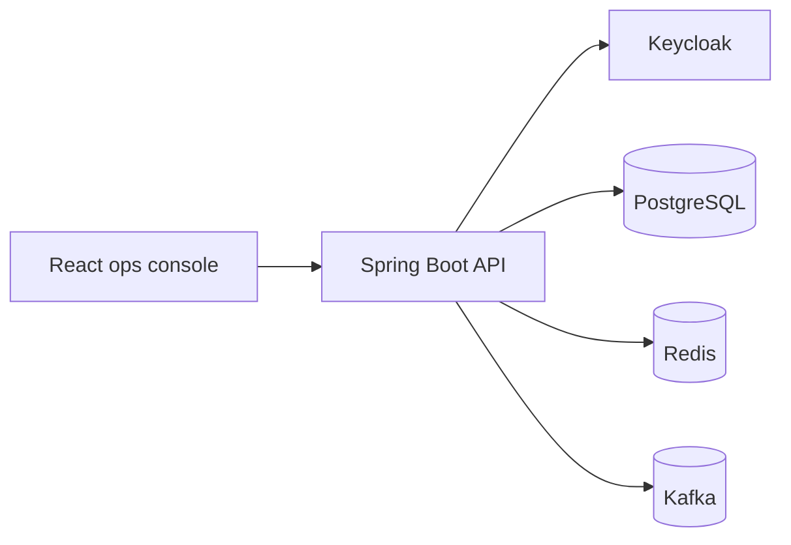

# Architecture

BazarFlow Core starts as a modular monolith because the first goal is strong business modeling, clear module boundaries, and a runnable local system. The architecture keeps service extraction possible later without paying distributed-systems costs during the MVP.

## Runtime Shape

## Modules

- `common`: shared platform value objects and API contracts
- `identity`: security configuration and current actor mapping
- `partner`: retailers, outlets, zones, and credit status
- `catalog`: products, SKUs, categories, and storage classes
- `inventory`: lots, stock movements, reservations, and expiry risk
- `pricing`: contract pricing, tiers, campaigns, and surcharges
- `ordering`: order intake, idempotency, and state transitions
- `fulfillment`: pick waves, dispatch jobs, and SLA risk
- `audit`: append-only operational audit and hash-chain checks
- `reporting`: dashboard read models
